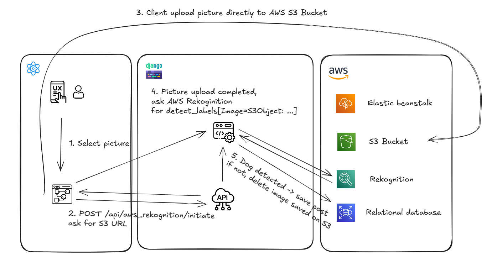
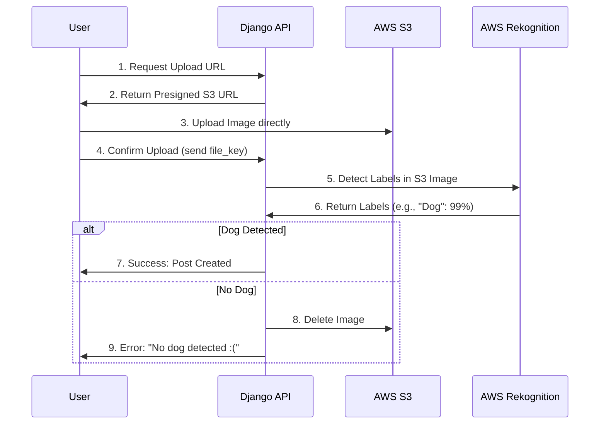

# Psiagram Backend 🐾

> A Django-based REST API for a niche social media platform dedicated exclusively to dogs, featuring AI-powered content moderation.

This is the backend repository. The frontend interface can be found here:

- **[Psiagram Frontend](https://github.com/Ralfmat/psiagram-frontend)** - The React-based user interface for this API.

## 💡 About The Project

Psiagram-backend repo is a backend API for a social network where users can share photos of their dogs.

Unlike standard social networks, Psiagram implements strict **AI-driven content moderation**. The system integrates with **AWS Rekognition** to analyze every uploaded photo in real-time. If the AI does not detect a dog in the image with sufficient confidence, the post is automatically rejected.

This project demonstrates the ability to integrate cloud-native services (AWS S3, Rekognition) into a Django architecture and implements a robust CI/CD pipeline for automated cloud deployment.

## ✨ Key Features

- **🐶 AI Content Moderation:** Uses **AWS Rekognition** to detect objects in uploaded images. Logic strictly enforces a "Dogs Only" policy, rejecting non-dog photos automatically.
- **Direct-to-Cloud Uploads:** Implements the **Presigned URL** pattern. Clients request an upload URL from the API, then upload images directly to **AWS S3**, reducing server load and improving scalability.

- **Social Graph:** Full implementation of Posts, Comments, Likes, and Groups.
- **Automated CI/CD:** A GitHub Actions workflow automatically builds, packages, and deploys the application to **AWS Elastic Beanstalk** on every push to main.
- **Authentication:** Secure JWT (JSON Web Token) authentication using `dj-rest-auth`.

## 🛠️ Tech Stack

### Core

- **Python 3.12 & Django 5.2**
- **Django REST Framework:** API development.
- **PostgreSQL:** Primary database.

### AWS Cloud Services

- **AWS Rekognition:** Image analysis and label detection.
- **AWS S3:** Object storage for media files.
- **AWS Elastic Beanstalk:** Platform-as-a-Service (PaaS) hosting.
- **Boto3:** AWS SDK for Python.

### DevOps

- **GitHub Actions:** Continuous Integration and Deployment.
- **Gunicorn:** WSGI HTTP Server.

## 🏗️ Architecture

The application handles high-resolution image uploads efficiently by offloading storage and processing to AWS.

